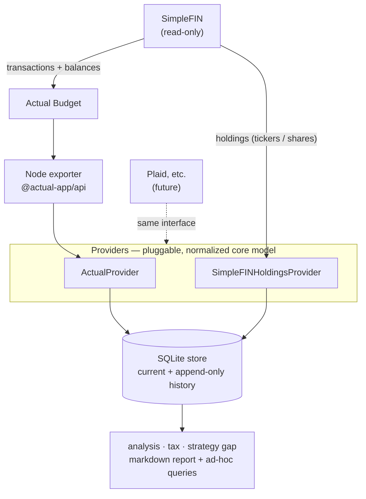

# plutus

[](https://github.com/kevinjclear/plutus/actions/workflows/ci.yml)
[](https://www.python.org/)
[](LICENSE)

A **read-only** personal-finance toolkit: it pulls your accounts and holdings automatically, then
reports **net worth**, **cash flow**, **asset allocation vs. a strategy you choose**, and
**tax-aware analysis** (withholding gap + tax-loss-harvesting candidates) — no manual CSV/PDF
imports.

> [!IMPORTANT]
> **Not financial or tax advice.** plutus produces *educational estimates from your own data*.
> It never moves money or places trades. Decisions are yours; consult a CPA for filing and a
> fiduciary for investment advice.

## How it works

plutus is a small hybrid. [Actual Budget](https://actualbudget.org) (self-hosted) owns the
banking/budgeting side and syncs your institutions via [SimpleFIN](https://www.simplefin.org/);
a dependency-light Python package owns the investing/strategy/tax analysis. Actual can't see
investment *holdings*, so those come straight from SimpleFIN.



## Features

- **Net worth** across all accounts (assets − liabilities), with append-only history snapshots.
- **Cash flow** by month and category (from Actual's categorized transactions).
- **Allocation vs. your strategy** — classify holdings into buckets, compare to target weights, and
  see the gap in % and $. Includes **fund look-through** (split a target-date/blended fund across
  buckets) and a rename-proof account matcher.
- **Tax module** — a withholding/estimated-payment gap projector and a **tax-loss-harvesting**
  finder (wash-sale aware) over taxable accounts. Educational estimates only.
- **Read-only & private by design** — no money movement; secrets and data never committed.

## Quick start (local, no infra)

```bash
git clone https://github.com/kevinjclear/plutus.git
cd plutus
python -m venv .venv && . .venv/bin/activate
pip install -e ".[dev]"
python -m pytest -q          # the whole suite runs on fixtures — no accounts needed
```

## Running it for real (Docker)

1. Copy `.env.example` to `.env` and fill in your SimpleFIN access URL + Actual password/sync id
   (in production, render these from your secrets manager — never commit `.env`).
2. `docker compose up -d actual-server`, open Actual, and link your institutions via SimpleFIN.
3. `docker compose run --rm exporter` — writes `data/exports/actual-export.json`.
4. Copy `config/*.example.yaml` → `config/*.yaml` and map each account (by name; matching falls back
   to the account-number token so renames don't break it). Copy `strategy.example.yaml` →
   `strategy.yaml` and tune your target weights + ticker→bucket map. Optionally fill
   `tax_profile.example.yaml` → `tax_profile.yaml` for the withholding analysis.
5. `scripts/plutus-run` (or the included `deploy/plutus-daily.{service,timer}` for a daily run)
   writes a markdown report to `data/reports/`.

## Configuration

| File | Purpose |
|------|---------|
| `strategy.yaml` | Target weights per bucket + `tickers:` (symbol→bucket) + optional `lookthrough:` (split a fund across buckets). |
| `config/actual_accounts.yaml` | Map each Actual account → `institution`/`type`/`tax_type`/`is_liability`. |
| `config/simplefin_accounts.yaml` | Same, for the SimpleFIN investment accounts that carry holdings. |
| `tax_profile.yaml` | Filing status, brackets, deduction, and your wages/withholding for the gap estimate. |
| `.env` | SimpleFIN access URL + Actual credentials (gitignored). |

## Privacy & safety

- **Read-only**: no provider method writes to a financial institution.
- `.gitignore` excludes the database, raw payloads, `.env`, tax documents, and personal configs.
- A future *trade-execution* layer (if ever added) would be separate, separately-credentialed, and
  human-in-the-loop — never folded into this read-only path.

## Testing

```bash
python -m pytest -q
```
Deterministic, fixture-based — no network, no real accounts. CI runs it on Python 3.12 and 3.13.

## License

[MIT](LICENSE) © Kevin Clear
